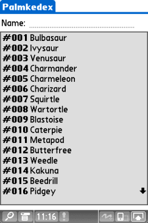
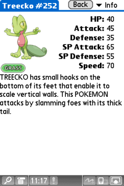
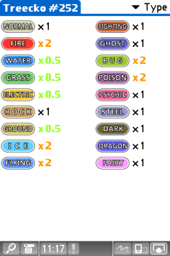

# Palmkedex
<p align="start">
    <a alt="Palm OS">
        
    </a>
    <a>
        
    </a>
        
</p>
Palmkedex is a Pokedex for Palm OS devices. It's compatible with every version of PalmOS, and supports almost any display combo!

It contains all 905 Pokémons avaliable at the [PokeAPI](https://pokeapi.co/), which is the data source for this project.

The low-res sprites for all pokemons were scrapped from the [rh-hideout/pokeemerald-expansion](https://github.com/rh-hideout/pokeemerald-expansion/tree/master) project. Many thanks to them for making the assets public! High-res sprites were scrapped from the PokeAPI as well.

## Why?
Why not? Palm OS devices are really capable of having a pokedex, and none were really available before this. And when playing DS/3DS Pokemon games, you will mostly likely already have a stylus on your hand and guess what, said stylus will work prefectly fine on Palm OS devices but not on your phone! So it's a bit more convenient in that use-case. And of course, it's another excuse for you to give your trusty PDA a go ;) It was a great way of practice programing, nevertheless.

## What is included?
- [X] All 905 pokemóns
- [X] Pokémon Stats
- [X] Pokémon Pokedex's description
- [X] Pokémon Sprites (in BMP Palette mode)
- [X] Type chart effectiveness
- [X] Filter while typing
- [ ] Pokémon Learnset
- [ ] Pokémon Abilities
- [ ] Pokémon Characteristics
- [ ] Pokémon Shiny Sprites
- [ ] Pokémon Evolution tree
- [ ] Pokémon Moves
- [ ] Pokémon Cries
- [ ] Items

All the items above will be added one day? I don't know :) If you know your way around C and Palm OS, feel free to submit a Pull Request.

## What is planned?
- [ ] Grid view (Application Launcher style, but with pokemóns)
- [X] Done! ~~Sprites in PNG instead of BMP (To save a lot of space)~~
- [X] Done! ~~Use the whole screen on 320x480 devices~~

## Downloads
You can find the binaries (the .prc files) in the release section of Github. [Or click here to go right to the latest version](https://github.com/Tavisco/Palmkedex/releases/latest). Do not mirror them elsewhere without my express permission.

**TLDR:** Install `Palmkedex.prc` and
- `SpritePack-lres-grey.prc` if your device has a low resolution (160x160 pixels) display and is greyscale
- `SpritePack-lres.prc` if your device has a low resolution (160x160 pixels) display and is color
- `SpritePack-hres-grey.prc` if your device has high resolution (320x320 or 320x480 pixels) and is greyscale
- `SpritePack-hres.prc` if your device has high resolution (320x320 or 320x480 pixels) and is color

You can also install no sprites at all and the dex will show a placeholder instead.

**Long version:** After downloading the zip file, you will find several PRC's: One containing the app itself and the others containing variations of all the sprites for the Pokemons. Every SpritePack contains images for ALL the Pokemons, what differs are the quality, size of them and the storage space they take. Only one SpritePack is needed at a give time, if another is installed, it will overwrite what already is on the device.

Those are the files you will find in the download package:
- `Palmkedex.prc` -  The Pokedex app. Contains the software, all Pokemon data and their type matches.
- `SpritePack-1bpp.prc` - This low-resolution (160x160) sprite pack uses very little storage, but only has two colors: Black and white. Only use this if you have almost no space left or if your device doesn't have a lot of memory. Recommended devices: Pilot 1000/5000/Personal/Pro
- `SpritePack-2bpp.prc` - This low-resolution (160x160) one has 4 shades of gray, dither better, but takes more space. The sprites look noticeably better than on 1bpp pack. Recommended devices: PalmPilot Personal/Pro
- `SpritePack-lres-grey.prc` - This one has 16 shades of gray, ideal to be used on every grayscale low-resolution (160x160) Palm device that has enough memory to hold it. Recommended devices: Palm III, Palm Vx, Palm M100, Palm M500, almost all Visors, etc.
- `SpritePack-lres.prc` - This one has 16 actual colors! Ideal to be used on every color low-resolution (160x160) Palm device that has enough memory to hold it. Recommended devices: Palm IIIc, Palm M130, Palm M515, Palm Zire 22, etc.
- `SpritePack-mres-grey.prc` - This one has greyscale sprites on medium resolution (240x320). HandEra devices are known to have it, more specifically the HandEra 330.
- `SpritePack-mres.prc` - Same as above, but with color sprites. Recommended device: Handera 330c, some Garnet devices may use that as well.
- `SpritePack-hres-grey.prc` - This one has greyscale sprites on high resolution (320x320 or 320x480 pixels)! This combo is mostly found on Sony devices running Palm OS 4.
- `SpritePack-hres.prc` - Same as above, but with color sprites! This one is intended for almost all high-resolution (320x320 or 320x480 pixels) colored devices! That contains most of the Palm OS 5 devices, and almost all Sony OS 4 and 5 devices as well. Recommended devices: Palm T|X, Palm LifeDrive, Palm T|W, almost all Sony color devices, etc.

Here is how each one of them looks:

`*-lres` pack:
| |  |  | | 
| :-: | :-:|:-:|:-:|
| 1bpp | 2bpp | lres-grey | lres |

`*-mres` pack:
|  |  | 
| :-: | :-:|
| mres-grey | mres | 

`*-hres` pack:
|  |  | 
| :-: | :-: |
| hres-grey | hres


## Screenshots
### Main screen:
|  |  | 
| :-: | :-: |

### Pokémon details:
|  |  |
| :-: | :-: |

### Type matchup:
|  |  |
| :-: | :-: |
## Building
You need ImageMagick installed on you system, specially the 'convert' tool.

```pip install beautifulsoup4```

First, with Python 3, run the script `build-pokedex-bins.py`. It will fetch all the data and create all the binary files that Palmkedex expects. Be sure to update the path on it to a clone of the PokeEmerald expasion project.

To build this application from source use the toolchain available [here](https://www.palm2000.com/projects/compilingAndBuildingPalmOsAppsOnUbuntu2004LTS.php), edit the paths of the building tools on the makefile, then simply run `make` in the root of the project.

## Special thanks
I'd like to thank all the people on [PalmDB's Discord Server](https://palmdb.net/) that helped me with issues with C and Palm OS development; that demonstrated interest in the project and pushed me forward to complete it; that sent ideas and opinated about the features and looks of it; and probably much more things. Many thanks to you all!

And of course:
- https://dmitry.gr/ - For help with the Palm OS API, building tools, patches and encouragement.

Pokémon and Pokémon character names are trademarks of Nintendo. This project is not affiliated with Nintendo nor The Pokemon Company in any way.