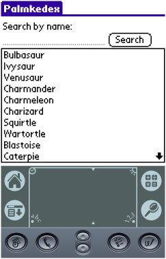
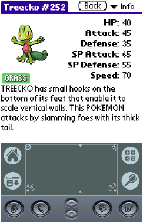
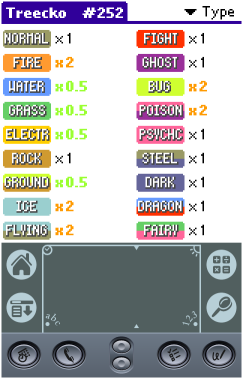

# Palmkedex
<p align="start">
    <a alt="Palm OS >= 3.5">
        
    </a>
    <a>
        
    </a>
        
</p>
Palmkedex is a Pokedex for Palm OS devices, running OS >= 3.5.0 (for now).

It contains all 905 Pokémons avaliable at the [PokeAPI](https://pokeapi.co/), which is the data source for this project.

The sprites for all pokemons were scrapped from the [rh-hideout/pokeemerald-expansion](https://github.com/rh-hideout/pokeemerald-expansion/tree/master) project. Many thanks to them for making the assets public!

## Why?
Why not? Palm OS devices are really capable of having a pokedex, and none were really available before this. And when playing DS/3DS Pokemon games, you will mostly likely already have a stylus on your hand and guess what, said stylus will work prefectly fine on Palm OS devices but not on your phone! So it's a bit more convenient in that use-case. And of course, it's another excuse for you to give your trusty PDA a go ;) It was a great way of practice programing, nevertheless.

## What is included?
- [X] All 905 pokemóns
- [X] Pokémon Stats
- [X] Pokémon Pokedex's description
- [X] Pokémon Sprites (in BMP Palette mode)
- [X] Type chart effectiveness
- [X] Filter while typing
- [ ] Pokémon Learnset
- [ ] Pokémon Abilities
- [ ] Pokémon Characteristics
- [ ] Pokémon Shiny Sprites
- [ ] Pokémon Evolution tree
- [ ] Pokémon Moves
- [ ] Pokémon Cries
- [ ] Items

All the items above will be added one day? I don't know :) If you know your way around C and Palm OS, feel free to submit a Pull Request.

## What is planned?
- [ ] Grid view (Application Launcher style, but with pokemóns)
- [X] Done! ~~Sprites in PNG instead of BMP (To save a lot of space)~~
- [ ] Use the whole screen on 320x480 devices
- [ ] Store the pokemon names in Database

## Downloads
You can find the binaries (the .prc files) in the release section of Github. [Or click here to go right to the latest version](https://github.com/Tavisco/Palmkedex/releases/latest). Do not mirror them elsewhere without my express permission.

After downloading the zip file, you will find two PRC's:
- `Palmkedex.prc` -  The main file of this project. Contains the software, all Pokemon data and their type matches.
- `PalmkedexSprites.prc` - (Optional) The color and grayscale sprites of all Pokemons. If you don't install it, a fallback image will be displayed instead.

## Screenshots
### Main screen:


### Pokémon details:


### Type matchup:

## Building
You need ImageMagick installed on you system, specially the 'convert' tool.

```pip install beautifulsoup4```

First, with Python 3, run the script `build-pokedex-bins.py`. It will fetch all the data and create all the binary files that Palmkedex expects. Be sure to update the path on it to a clone of the PokeEmerald expasion project.

To build this application from source use the toolchain available [here](https://www.palm2000.com/projects/compilingAndBuildingPalmOsAppsOnUbuntu2004LTS.php), edit the paths of the building tools on the makefile, then simply run `make` in the root of the project.

## Special thanks
I'd like to thank all the people on [PalmDB's Discord Server](https://palmdb.net/) that helped me with issues with C and Palm OS development; that demonstrated interest in the project and pushed me forward to complete it; that sent ideas and opinated about the features and looks of it; and probably much more things. Many thanks to you all!

And of course:
- https://dmitry.gr/ - For help with the Palm OS API, building tools and encouragement.

Pokémon and Pokémon character names are trademarks of Nintendo. This project is not affiliated with Nintendo nor The Pokemon Company in any way.