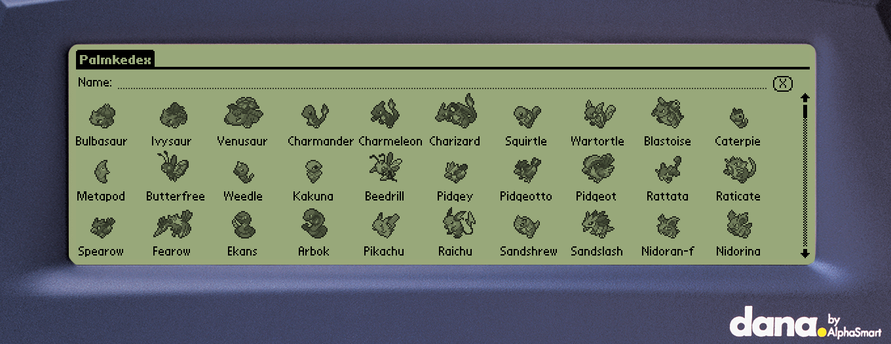

# Palmkedex

    
    
        

Palmkedex is a Pokedex for Palm OS devices. It's compatible with every version of PalmOS, and supports (afaik) every Palm OS device made.

It contains all 1010 Pokémons avaliable at [PokemonDB](https://pokemondb.net/pokedex/), which is the data source for this project. 
The sprites were sourced from there, and also from the PokeAPI.

## Why?
Why not? Palm OS devices are really capable of having a pokedex, and none were really available before this. And when playing DS/3DS Pokemon games, you will mostly likely already have a stylus on your hand and guess what, said stylus will work prefectly fine on Palm OS devices but not on your phone! So it's a bit more convenient in that use-case. And of course, it's another excuse for you to give your trusty PDA a go ;) It was a great way of practice programing, nevertheless and I learnt a lot from it.

## Demo

You can use it directly on your browser by [checking out the demo here](https://palm.tavisco.dev). Just click on Palmkedex, and then on the "Launch" button. It will emulate a Sony Clie NR70v, which is a Palm OS 4 device with 16MB of RAM, 16 bpp color density, and a high resolution screen.

If you just want to see how it looks, check out the [screenshots](#screenshots) section of this document.

## Features
- All 1010 pokemóns (Updated for Pokémon Scarlet & Violet)
- Pokémon Stats
- Pokémon Pokedex's description
- Pokémon Sprites
- Pokémon Icons
- Type chart effectiveness
- Track seen and caught Pokémons
- Adventure mode, hiding Pokémon details based on seen, and caught status
- Minimal version, which is intended to Palm OS 1.0/2.0 devices that have very low memory
- Support for virtually *ALL* Palm OS devices (if you cannot run this on a device, please let me know!)
- Support for Palm OS 5 special features (High Density API)
- Support for Sony's special features (Jog dial and HRes)
- Support for Handera special features (VGA Display)
- Support for Dana (Wide Screen)
- Highly optimized image and data compressor/decompressor specially tailored for Palm OS devices (Thanks Dmitry!)
- Dynamic QR Code generation to open PokemonDB's page for the selected Pokemon

## What is planned?
- [X] Done! ~~Grid view (Application Launcher style, but with pokemóns)~~
- [X] Done! ~~Sprites NOT in BMP (To save a lot of space)~~
- [X] Done! ~~Use the whole screen on 320x480 devices~~
- [X] Done! ~~Track seen and caught pokémons~~
- [X] Done! ~~Hide pokemon and it's details based on seen and caught status~~
- [ ] Pokémon Learnset
- [ ] Pokémon Abilities
- [ ] Pokémon Natures
- [ ] Pokémon Shiny Sprites
- [ ] Pokémon Evolution tree
- [ ] Pokémon Moves
- [ ] Pokémon Cries
- [ ] Items

All the items above will be added one day? I don't know :) If you know your way around C and Palm OS, feel free to submit a Pull Request.

## Downloads
[Click here to go right to the latest version](https://github.com/Tavisco/Palmkedex/releases/latest). Do not mirror them elsewhere without my express permission.

You can find the binaries (the .prc files) in the release section of Github, or at [PalmDB](https://palmdb.net/app/palmkedex). 

## How to install

You normally will want to install three things:
- The Palmkedex app;
- The Sprite pack, which is the "big" image of Pokemon, it is shown when you are viewing it's details;
- The Icon pack, which is "small" image of a Pokemon, it is shown at the main screen before selecting a Pokemon.

The Sprite and Icon pack are optional, you may not install them to save space (which will cause a placeholder to be shown instead). You can also install only one of the packs.

### TLDR
Install `Palmkedex.prc` then
- `SpritePack-lres-4bpp.prc` and `IconPack-lres-4bpp.prc` if your device has a low resolution display (160x160 pixels) and is greyscale
- `SpritePack-lres-16bpp.prc` and `IconPack-lres-16bpp.prc` if your device has a low resolution display (160x160 pixels) and is color
- `SpritePack-hres-4bpp.prc` and `IconPack-hres-4bpp.prc` if your device has high resolution display (320x320 or 320x480 pixels) and is greyscale
- `SpritePack-hres-16bpp.prc` and `IconPack-hres-16bpp.prc` if your device has high resolution display (320x320 or 320x480 pixels) and is color

### Long version
#### Main software (required):

- `Palmkedex.prc` - The app. Contains the application and all the Pokemon data.
- `Palmkedex-minimal.prc` - Same as above, but intended for devices with restricted storage. It only has low-resolution bitmaps, does not support color, screen resize, and has no specific device code (like Sony Clie's JogDial, Handera screen modes, etc). Useful for Palm OS 1.0/2.0 devices with 1MB or less of RAM.

#### Images packs (optional, but recommended):

As explained above, there two packs:
- Sprite Pack, which is the "big" image of Pokemon, it is shown when you are viewing it's details;
- Icon pack, which is "small" image of a Pokemon, it is shown at the main screen grid before selecting a Pokemon.

You normally will want to install both, but in reality, neither are mandatory. You can install only one of them as well.

**Pack Types**

Install only **one sprite pack, and one icon pack** based on your device's screen resolution and color depth.

The main aspects that will determine which pack to install is screen resolution and color density. There are three resolutions:
- Low Resolution - lres (160x160)
- Medium Resolution - mres (240x240/240x320)
- High Resolution - hres (320x320/320x480)

And four color densities:
- 1bpp (Monochrome, black and white)
- 2bpp (4 shades of gray)
- 4bpp (16 shades of gray)
- 16bpp (65536 colors, being the only one which is not grayscale)

Check your device specs to know which is the correct combination for your device. You can use the table below as a reference.

|  | lres | mres | hres |
|---|---|---|---|
| **1bpp** | Pilot 1000/5000/Personal/Pro | some rePalm devices | N/A |
| **2bpp** | PalmPilot III series | some rePalm devices | N/A |
| **4bpp** | Palm Vx, Palm M100, M125, Palm M500, Visors, earlier Sony monochrome devices | Handera 330, some rePalm Devices | Sony SL-10 |
| **16bpp** | Palm IIIc, earlier Sony devices with color, Palm M130, Palm M500, Palm M515, Visor Prism | Handera 330c, some rePalm devices | Palm Tungsten T5, T\|X, T\|W, T\|C, Zire 71, Zire 72, Sony Clie NX, TH, UX lines, Treos, Centro |

Please note that the table provided is not exhaustive. It is recommended to consult your device's specifications to determine the appropriate pack for your specific model. 
Choosing the correct pack ensures optimal display quality and compatibility with your device.

Here is how each one of them looks:

**`*-lres` pack:**
| 1bpp | 2bpp | 4bpp | 16bpp |
| :-: | :-:|:-:|:-:|
| |  |  | | 

**`*-mres` pack:**
| 4bpp | 16bpp |
| :-: | :-:|
|  |  | 

**`*-hres` pack:**
| 4bpp | 16bpp |
| :-: | :-: |
|  |  | 

## Screenshots
### Main screen:
|  |  | 
| :-: | :-: |

### Pokémon details (A bit outdated):
|  |  |
| :-: | :-: |

### Type matchup:
|  |  |
| :-: | :-: |

## Screenshots on unusual devices

|  |  |
| :-: | :-: |
| Dana (V1.3) | Dana rotated (V1.3) |

|  |  |
| :-: | :-: |
| HandEra 330 | HandEra rotated 330|

|  |  |
| :-: | :-: |
| HandEra 330c (v1.1) | Handera 330c (V1.4)

|  |
| :-: |
| Weird resolution on Cobalt (V1.3) |

|  |
| :-: |
| [rePalm](https://dmitry.gr/?r=05.Projects&proj=27.%20rePalm) on Dell Axim X30 (V1.4) |

## Building

To build this application from source use the toolchain available [here](https://www.palm2000.com/projects/compilingAndBuildingPalmOsAppsOnUbuntu2004LTS.php), edit the paths of the building tools on the makefile, then simply run `make` in the root of the project.

## Special thanks
I'd like to thank all the people on [PalmDB's Discord Server](https://palmdb.net/) that helped me with issues with C and Palm OS development; that demonstrated interest in the project and pushed me forward to complete it; that sent ideas and opinated about the features and looks of it; and probably much more things. Many thanks to you all!

And of course:
- https://dmitry.gr/ - For help with the Palm OS API, building tools, patches and encouragement.

## Disclaimer

Pokémon and Pokémon character names, sprites and whatnot are trademarks of Nintendo. This project is not affiliated with Nintendo nor The Pokemon Company in any way.