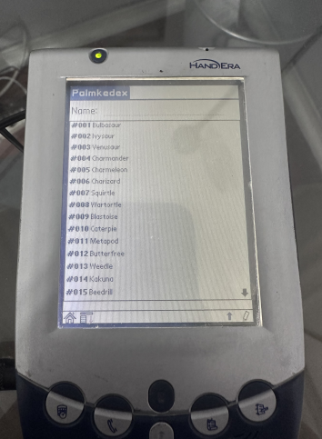
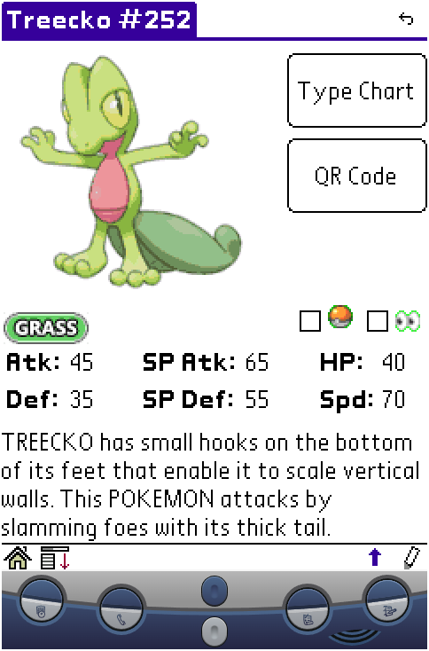

# Palmkedex

    
    
        

Palmkedex is a Pokedex for Palm OS devices. It's compatible with every version of PalmOS, and supports almost any display combo!

It contains all 1010 Pokémons avaliable at [PokemonDB](https://pokemondb.net/pokedex/), which is the data source for this project. 
The sprites were sourced from there, and from the PokeAPI.

## Why?
Why not? Palm OS devices are really capable of having a pokedex, and none were really available before this. And when playing DS/3DS Pokemon games, you will mostly likely already have a stylus on your hand and guess what, said stylus will work prefectly fine on Palm OS devices but not on your phone! So it's a bit more convenient in that use-case. And of course, it's another excuse for you to give your trusty PDA a go ;) It was a great way of practice programing, nevertheless and I learnt a lot from it.

## Demo

You can use it directly on your browser by [checking out the demo here](https://palm.tavisco.dev). It will emulate a Sony Clie NR70v, which is a Palm OS 4 device with 16MB of RAM, 16 bpp color density, and a high resolution screen.

If you just want to see how it looks, check out the [screenshots](#screenshots) section of this document.

## Features
- All 1010 pokemóns (Updated for Pokémon Scarlet & Violet)
- Pokémon Stats
- Pokémon Pokedex's description
- Pokémon Sprites
- Pokémon Icons
- Type chart effectiveness
- Track seen and caught Pokémons
- Adventure mode, hiding Pokémon details based on seen, and caught status
- Support for virtually *ALL* Palm OS devices (if you cannot run this on a device, please let me know!)
- Support for Palm OS 5 special features (High Density API)
- Support for Sony's special features (Jog dial and HRes)
- Support for Handera special features (VGA Display)
- Support for Dana (Wide Screen)
- Highly optimized image and data compressor/decompressor specially tailored for Palm OS devices (Thanks Dmitry!)
- Dynamic QR Code generation to open PokemonDB's page for the selected Pokemon

## What is planned?
- [X] Done! ~~Grid view (Application Launcher style, but with pokemóns)~~
- [X] Done! ~~Sprites NOT in BMP (To save a lot of space)~~
- [X] Done! ~~Use the whole screen on 320x480 devices~~
- [X] Done! ~~Track seen and caught pokémons~~
- [X] Done! ~~Hide pokemon and it's details based on seen and caught status~~
- [ ] Pokémon Learnset
- [ ] Pokémon Abilities
- [ ] Pokémon Natures
- [ ] Pokémon Shiny Sprites
- [ ] Pokémon Evolution tree
- [ ] Pokémon Moves
- [ ] Pokémon Cries
- [ ] Items

All the items above will be added one day? I don't know :) If you know your way around C and Palm OS, feel free to submit a Pull Request.

## Downloads
[Click here to go right to the latest version](https://github.com/Tavisco/Palmkedex/releases/latest). Do not mirror them elsewhere without my express permission.

You can find the binaries (the .prc files) in the release section of Github, or at [PalmDB](https://palmdb.net/app/palmkedex). 

### TLDR
Install `Palmkedex.prc` and
- `SpritePack-lres-4bpp.prc` if your device has a low resolution display (160x160 pixels) and is greyscale
- `SpritePack-lres-16bpp.prc` if your device has a low resolution display (160x160 pixels) and is color
- `SpritePack-hres-4bpp.prc` if your device has high resolution display (320x320 or 320x480 pixels) and is greyscale
- `SpritePack-hres-16bpp.prc` if your device has high resolution display (320x320 or 320x480 pixels) and is color

You can also install no sprites at all and the dex will show a placeholder instead.

### Long version
Main software (required):
- Palmkedex.prc - The main file of this project. Contains the application and all the Pokemon data.
- Palmkedex-minimal.prc - Same as above, but intended for devices with restricted storage. It only has low-resolution bitmaps, does not support color, screen resize, and has no specific device code (like Sony Clie's JogDial, Handera screen modes, etc).

Sprite packs:
These optional files contain the Pokemon sprites (images). While not required, they are highly recommended for the best experience. Install only one of them based on your device's screen resolution and color depth.

They are devided in three categories: Low-resolution, Medium-resolution and High-resolution.

Low resolution: Intended for devices with 160x160 screen resolution
- SpritePack-lres-1bpp.prc  - Sprite pack for low-resolution devices. Black and white sprites. (Pilot 1000/5000/Personal/Pro)
- SpritePack-lres-2bpp.prc  - Sprite pack for low-resolution devices. 4 shades of gray. (PalmPilot Personal/Pro, or later devices if you want to save space)
- SpritePack-lres-4bpp.prc  - Sprite pack for low-resolution devices. 16 shades of gray. (Palm Vx, Palm M100, M125, Palm M500, Visors, earlier Sony monochrome devices, etc)
- SpritePack-lres-16bpp.prc - Sprite pack for low-resolution devices. Color. (Palm IIIc, earlier Sony devices with color, Palm M130, Palm M500, Palm M515, Visor Prism, etc.)

Medium resolution: Intended for devices with 240x240/240x320 screen resolution. (ie. Handera 330, RePalm devices, etc)
- SpritePack-mres-1bpp.prc  - Sprite pack for medium-resolution devices. Black and white sprites.
- SpritePack-mres-2bpp.prc  - Sprite pack for medium-resolution devices. 4 shades of gray.
- SpritePack-mres-4bpp.prc  - Sprite pack for medium-resolution devices. 16 shades of gray.
- SpritePack-mres-16bpp.prc - Sprite pack for medium-resolution devices. Color.

High resolution: Intended for devices with 320x320/320x480 screen resolution.
- SpritePack-hres-4bpp.prc  - Sprite pack for high-resolution devices. 16 shades of gray. (Sony SL-10)
- SpritePack-hres-16bpp.prc - Sprite pack for high-resolution devices. Color. (Palm Tungsten T5, T|X, T|W, T|C, Zire 71, Zire 72, Sony Clie NX, TH, UX lines, etc)

Please note that the compatibility list provided is not exhaustive. It is recommended to consult your device's specifications to determine the appropriate sprite pack for your specific model. 
Choosing the correct sprite pack ensures optimal display quality and compatibility with your device.

Here is how each one of them looks:

`*-lres` pack:
| |  |  | | 
| :-: | :-:|:-:|:-:|
| 1bpp | 2bpp | 4bpp | 16bpp |

`*-mres` pack:
|  |  | 
| :-: | :-:|
| 4bpp | 16bpp | 

`*-hres` pack:
|  |  | 
| :-: | :-: |
| 4bpp | 16bpp |

## Screenshots
### Main screen:
|  |  | 
| :-: | :-: |

### Pokémon details (A bit outdated):
|  |  |
| :-: | :-: |

### Type matchup:
|  |  |
| :-: | :-: |

## Screenshots on unusual devices

|  |  |
| :-: | :-: |
| Dana (V1.3) | Dana rotated (V1.3) |

|  |  |
| :-: | :-: |
| HandEra 330 | HandEra rotated 330|

|  |  |
| :-: | :-: |
| HandEra 330c (v1.1) | Handera 330c (V1.4)

|  |
| :-: |
| Weird resolution on Cobalt (V1.3) |

|  |
| :-: |
| [rePalm](https://dmitry.gr/?r=05.Projects&proj=27.%20rePalm) on Dell Axim X30 (V1.4) |

## Building

To build this application from source use the toolchain available [here](https://www.palm2000.com/projects/compilingAndBuildingPalmOsAppsOnUbuntu2004LTS.php), edit the paths of the building tools on the makefile, then simply run `make` in the root of the project.

## Special thanks
I'd like to thank all the people on [PalmDB's Discord Server](https://palmdb.net/) that helped me with issues with C and Palm OS development; that demonstrated interest in the project and pushed me forward to complete it; that sent ideas and opinated about the features and looks of it; and probably much more things. Many thanks to you all!

And of course:
- https://dmitry.gr/ - For help with the Palm OS API, building tools, patches and encouragement.

## Disclaimer

Pokémon and Pokémon character names are trademarks of Nintendo. This project is not affiliated with Nintendo nor The Pokemon Company in any way.